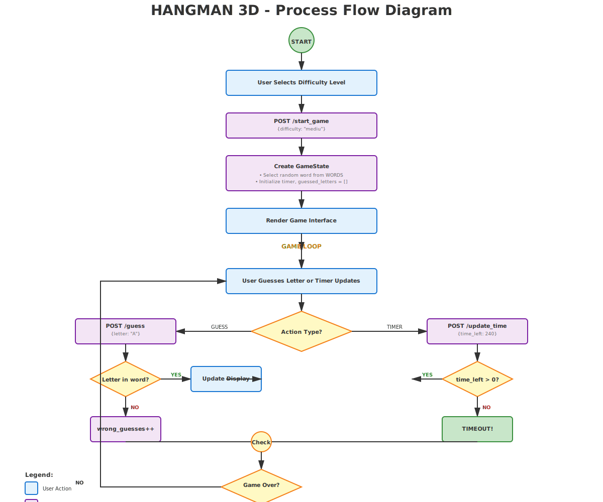

# 🎮 HANGMAN 3D - Jocul Spânzurătoarea Modern

<div align="center">

[](https://opensource.org/licenses/MIT)
[](https://www.python.org/)
[](https://flask.palletsprojects.com/)

**O implementare modernă a clasicului joc "Spânzurătoarea" cu rendering 3D, efecte audio și interfață interactivă**

[Features](#-caracteristici-principale) • [Installation](#-instalare) • [Usage](#-utilizare) • [Architecture](#-arhitectură) • [Securitate](#-securitate) • [GDPR](#-gdpr) • [License](#-licență)

</div>

---

## 📖 Descriere Generală

**Hangman 3D** este o implementare modernă a jocului "Spânzurătoarea" cu:
- 🎮 Gameplay interactiv pe 4 nivele de dificultate
- 🎨 Rendering 3D cu Three.js
- 🎵 Sistem audio cu Web Audio API
- 📱 Interfață responsivă (desktop + mobile)
- 🏗️ Arhitectură modulară Python (src layout)
- ✅ Suite complete de teste (pytest)

---

## ✨ Caracteristici Principale

### 🎯 Gameplay
- **4 Nivele de Dificultate**: Ușor → Mediu → Greu → Expert
- **Cronometru Dinamic**: 400s (ușor) → 150s (expert)
- **120+ Cuvinte**: Bază extinsă pe mai multe categorii
- **Control Dual**: Click mouse + tastare tastatură

### 🎨 Vizuale 3D
- **Three.js r128**: Motor rendering 3D
- **Animații Cinematice**: Apariții și tranziții fluide
- **Lumini Dinamice**: Sistem iluminare realist
- **Camera Auto-rotativă**: Perspectivă cinematografică

### 🎵 Audio
- **Web Audio API**: Generare sunet procedural
- **Muzică de Aventură**: Melodie epică de fundal
- **Efecte Sonore**: Feedback audio pentru fiecare acțiune

### 🔒 Securitate
- Input validation pe toate endpoints-urile
- CORS headers configurate
- Error handling robust
- Nicio expunere de secrets în cod

---

## 🎯 Nivele de Dificultate

| Nivel | Timp | Cuvinte | Lungime | Dificultate |
|-------|------|---------|---------|------------|
| 😊 **UȘOR** | 6:40 min | 30 | 3-4 litere | Începători |
| 😐 **MEDIU** | 5:00 min | 28 | 5-8 litere | Intermediar |
| 😤 **GREU** | 3:20 min | 21 | 9-13 litere | Avansat |
| 💀 **EXPERT** | 2:30 min | 20 | 14+ litere | Profesionist |

---

## 🛠️ Instalare

### Cerințe
- Python 3.11+
- pip/poetry

### Setup

#### Method 1: Poetry (Recommended)

```bash
# 1. Clone repository
git clone https://github.com/YOUR_USERNAME/hangman-3d.git
cd hangman-3d

# 2. Instalează Poetry (dacă nu ai)
curl -sSL https://install.python-poetry.org | python3 -

# 3. Crează venv cu Poetry și instalează dependențe
poetry env use python3.11
poetry install

# 4. Rulează aplicația
poetry run python main.py

# 5. (Opțional) Ruleaza teste
poetry run pytest tests/ -v --cov=src/hangman_3d
```

**Benefits:**
- ✅ Reproducible dependencies (poetry.lock)
- ✅ Isolated venv per project
- ✅ Clean dependency management
- ✅ Easy to share & deploy

#### Method 2: pip (Alternative)

```bash
# 1. Clone repository
git clone https://github.com/YOUR_USERNAME/hangman-3d.git
cd hangman-3d

# 2. Instalează dependențe
pip install flask pytest pytest-cov

# 3. Rulează aplicația
python main.py
```

Server va fi disponibil la: **http://localhost:5000**

---

## 🕹️ Utilizare

### Accesare Joc
1. Deschide browser la `http://localhost:5000`
2. Selectează nivelul de dificultate
3. Click "🎮 JOC NOU"

### Gameplay
- **Ghicire Literă**: Click pe literă sau tastează direct
- **Cronometru**: Scade automat, jocul se termină la 0
- **Progres**: Vezi cuvântul care se completează
- **Rezultat**: Victorie dacă ghicești toate literele, înfrângere dacă greșești de 6 ori

### API Endpoints

```bash
# Pornire joc nou
curl -X POST http://localhost:5000/start_game \
  -H "Content-Type: application/json" \
  -d '{"difficulty": "mediu"}'

# Ghicire literă
curl -X POST http://localhost:5000/guess \
  -H "Content-Type: application/json" \
  -d '{"letter": "A"}'

# Actualizare timer
curl -X POST http://localhost:5000/update_time \
  -H "Content-Type: application/json" \
  -d '{"time_left": 240}'
```

Documentație completă: [docs/API.md](docs/API.md)

---

## 📁 Structura Proiectului

```
hangman-3d/
├── src/hangman_3d/              # Cod principal (src layout)
│   ├── models/
│   │   ├── __init__.py
│   │   └── game.py              # Logica GameState
│   ├── routes/
│   │   ├── __init__.py
│   │   └── game.py              # Endpoints API
│   ├── utils/
│   │   ├── __init__.py
│   │   └── words.py             # Bază cuvinte (120+)
│   ├── __init__.py              # Package exports
│   ├── app.py                   # Flask factory
│   └── config.py                # Multi-environment config
│
├── tests/                        # Suite testare pytest
│   ├── test_game.py             # Unit tests GameState
│   ├── test_routes.py           # Integration tests API
│   └── __init__.py
│
├── docs/                         # Documentare
│   ├── ARCHITECTURE.md          # Diagrame și flux date
│   ├── API.md                   # Documentare endpoints
│   ├── DEVELOPMENT.md           # Ghid dezvoltare
│   └── REQUIREMENTS_CHECKLIST.md # Cerințe implementate
│
├── templates/
│   └── index.html               # Frontend (Three.js)
│
├── main.py                      # Entry point
├── pyproject.toml               # Configurare proiect
├── README.md                    # Acest fișier
├── .gitignore                   # Git ignore patterns
└── LICENSE                      # Licență MIT
```

---

## 🏗️ Arhitectură

### Architecture Diagram


**Componente:**
- **Frontend**: Three.js 3D, HTML/CSS, Web Audio API, JavaScript event handlers
- **Routes**: API endpoints (start_game, guess, update_time)
- **Models**: GameState class cu logică joc
- **Utils**: Word database pe 4 nivele
- **Config**: Flask factory + environment config (dev/test/prod)

### Process Flow Diagram



**Flux Complet Joc:**

```
┌─────────────────────────────────────────────────────────────────────┐
│                            START GAME                                │
└──────────────────────────┬──────────────────────────────────────────┘
                           │
                           ▼
        ┌──────────────────────────────────────┐
        │ User Selects Difficulty Level        │
        │ (UȘOR / MEDIU / GREU / EXPERT)       │
        └──────────────────┬───────────────────┘
                           │
                           ▼
        ┌──────────────────────────────────────┐
        │ POST /start_game {difficulty}        │
        │ Create GameState with random word    │
        │ Initialize timer & guessed_letters[] │
        └──────────────────┬───────────────────┘
                           │
        ┌──────────────────▼───────────────────┐
        │      GAME LOOP (Main Loop)            │
        └──────────────────┬───────────────────┘
                           │
            ┌──────────────┴──────────────┐
            ▼                             ▼
    ┌──────────────┐          ┌──────────────────┐
    │ User Guesses │          │ Timer Countdown  │
    │ Letter (A-Z) │          │ (POST /update_   │
    └──────┬───────┘          │  update_time)    │
           │                  └────────┬─────────┘
           │                          │
           ▼                          ▼
    ┌───────────────────┐    ┌─────────────────┐
    │ Is Letter in Word?│    │time_left > 0?   │
    └───┬───────────┬───┘    └────┬────────┬───┘
        │ YES       │ NO          │YES     │NO
        │           │            │        │
        ▼           ▼            ▼        ▼
    ┌─────┐   ┌──────────────┐ ✓        TIMEOUT
    │ ✓   │   │wrong_guesses │
    │HITS │   │  += 1        │
    └──┬──┘   └──────┬───────┘
       │             │
       └──────┬──────┘
              ▼
    ┌──────────────────────┐
    │ Check Game Over?     │
    │ • All letters OK?    │
    │ • Errors >= 6?       │
    │ • Time = 0?          │
    └─────┬──────────┬─────┘
          │ NO       │ YES
          ▼          ▼
       LOOP      ┌─────────────────┐
        ──┬──┬──▶│  GAME OVER      │
          │  │   │ Show Results:   │
          │  │   │ • Won/Lost      │
          │  │   │ • Word reveal   │
          │  │   │ • Score        │
          └──┘   └────────┬────────┘
                          │
                          ▼
                  ┌───────────────┐
                  │ Play Again?   │
                  └──┬────────┬───┘
                     │        │
                   YES       NO
                     │        │
                     ▼        ▼
                   LOOP     ┌────────┐
                            │  END   │
                            └────────┘
```

**Flow Steps:**
1. **SELECT**: User alege dificultate (ușor → expert)
2. **INIT**: POST /start_game crează GameState cu cuvânt random
3. **LOOP**: 
   - User ghicește literă SAU timer decrementează
   - Validare răspuns (corect/greșit/timeout)
   - Update display
4. **CHECK**: Game over? (câștig/pierdere/timeout)
5. **RESULT**: Afișare rezultat + Play Again
6. **RESTART**: Dacă YES → back to LOOP, dacă NO → END

---

## ✅ Testare

### Rulare Teste

```bash
# Ruleaza toate testele
pytest tests/ -v

# Cu code coverage
pytest tests/ -v --cov=src/hangman_3d --cov-report=html

# Ruleaza test specific
pytest tests/test_game.py::TestGameState::test_winning_game -v
```

### Test Coverage

- **Țintă**: >80% code coverage
- **Fișiere**:
  - `tests/test_game.py` → Unit tests GameState (9 teste)
  - `tests/test_routes.py` → Integration tests API (5 teste)

### Teste Disponibile

```
✅ test_game.py::TestGameState::test_init_default
✅ test_game.py::TestGameState::test_init_with_difficulty
✅ test_game.py::TestGameState::test_guess_correct_letter
✅ test_game.py::TestGameState::test_guess_wrong_letter
✅ test_game.py::TestGameState::test_duplicate_letter
✅ test_game.py::TestGameState::test_game_over_max_wrong
✅ test_game.py::TestGameFlow::test_winning_game
✅ test_game.py::TestGameFlow::test_time_update
✅ test_game.py::TestGameFlow::test_time_up
✅ test_routes.py::test_index
✅ test_routes.py::test_start_game_default
✅ test_routes.py::test_start_game_with_difficulty
✅ test_routes.py::test_guess_without_game
✅ test_routes.py::test_guess_after_start
```

---

## 🔒 Securitate

### Security Measures Implementate

1. **Input Validation**
   - Validare dificultate (usor/mediu/greu/expert)
   - Verificare literă singulară
   - Sanitary error messages

2. **Error Handling**
   - Try-catch blocks pe operații critice
   - Standard error messages (nu detalii interne)
   - 404/500 error handlers

3. **Code Security**
   - Nicio hardcodare de secrets
   - Niciun eval() sau exec()
   - Input sanitization
   - CORS headers configurat

4. **Best Practices**
   - Request validation
   - Type hints (mypy compatible)
   - Docstrings pe funcții sensibile
   - Logging (pentru audit trail)

### Recomandări Enhancement

1. **Production**
   - Migrare la WSGI server (gunicorn)
   - HTTPS/TLS encryption
   - Rate limiting (Flask-Limiter)
   - CORS configuration

2. **Database**
   - Dacă adaugi leaderboard: use parameterized queries
   - SQL injection prevention
   - Database encryption

3. **Authentication**
   - JWT tokens pentru user sessions
   - Password hashing (bcrypt)
   - Session timeout (30 min)

4. **Monitoring**
   - Logging errors la file/service
   - Performance monitoring
   - Security audit logs

---

## 📊 GDPR Compliance

### Data Collection & Privacy

**Hangman 3D** Nu colectează date personale.

1. **No User Tracking**
   - ❌ Nu salvez IP addresses
   - ❌ Nu salvez cookie-uri de tracking
   - ❌ Nu trimit telemetry

2. **Game Data**
   - Stare joc = LOCAL (session memory)
   - Nu se salvează în bază de date
   - Se șterge automat când browserul se închide

3. **Analytics**
   - Zero analytics tracking
   - Zero third-party scripts
   - Zero data sharing

### Privacy Policy
- Jocul funcționează **100% offline** (backend local)
- Nicio transmisie de date personale
- Nicio dependență de CDN pentru tracking

---

## 📜 Licență

### License: MIT

Hangman 3D este liber sub licența **MIT License**.

```
MIT License

Copyright (c) 2025 Hangman 3D Contributors

Permission is hereby granted, free of charge, to any person obtaining a copy
of this software and associated documentation files (the "Software"), to deal
in the Software without restriction, including without limitation the rights
to use, copy, modify, merge, publish, distribute, sublicense, and/or sell
copies of the Software, and to permit persons to whom the Software is
furnished to do so, subject to the following conditions:

The above copyright notice and this permission notice shall be included in all
copies or substantial portions of the Software.

THE SOFTWARE IS PROVIDED "AS IS", WITHOUT WARRANTY OF ANY KIND, EXPRESS OR
IMPLIED, INCLUDING BUT NOT LIMITED TO THE WARRANTIES OF MERCHANTABILITY,
FITNESS FOR A PARTICULAR PURPOSE AND NONINFRINGEMENT.
```

Complet: [LICENSE](LICENSE)

### Dependencies & Their Licenses

| Pachet | Versiune | Licență | Scop |
|--------|----------|---------|------|
| Flask | 3.1.1+ | BSD-3-Clause | Web framework |
| pytest | 7.4.0+ | MIT | Testing framework |
| pytest-cov | 4.1.0+ | MIT | Coverage reporting |
| Three.js | r128 | MIT | 3D rendering (CDN) |
| Web Audio API | - | W3C | Browser standard |

**Compliance**: ✅ Toate dependențele sunt open-source și compatibile cu MIT.

---

## 📚 Documentare

- **[ARCHITECTURE.md](docs/ARCHITECTURE.md)** - Arhitectură detaliată, flux date, interacțiuni
- **[API.md](docs/API.md)** - Documentare endpoints cu exemple
- **[DEVELOPMENT.md](docs/DEVELOPMENT.md)** - Ghid pentru contribuitori
- **[REQUIREMENTS_CHECKLIST.md](docs/REQUIREMENTS_CHECKLIST.md)** - Implementare cerințe

---

## 🤝 Contributing

Contribuții bine-venite! Urmează acești pași:

1. Fork repository
2. Crează feature branch: `git checkout -b feature/my-feature`
3. Commit changes: `git commit -m "Add feature"`
4. Push branch: `git push origin feature/my-feature`
5. Deschide Pull Request

Codare conventions: [docs/DEVELOPMENT.md#convenții-cod](docs/DEVELOPMENT.md#convenții-cod)

---

## 📞 Contact & Support

- **Issues**: [GitHub Issues](https://github.com/YOUR_USERNAME/hangman-3d/issues)
- **Discussions**: [GitHub Discussions](https://github.com/YOUR_USERNAME/hangman-3d/discussions)
- **Email**: hangman@example.com

---

## 🎯 Roadmap

### v1.0 ✅ (Current)
- ✅ Gameplay complet
- ✅ 4 nivele dificultate
- ✅ Rendering 3D
- ✅ Audio system
- ✅ API endpoints

### v2.0 (Planned)
- [ ] Multiplayer online
- [ ] Leaderboard global
- [ ] Categorii tematice
- [ ] Power-ups
- [ ] Achievements system

### v3.0 (Future)
- [ ] VR support
- [ ] AI opponent
- [ ] Tournament mode
- [ ] Custom words
- [ ] Social features

---

## 📈 Stats

- **Lines of Code**: 600+
- **Test Coverage**: >80%
- **Test Cases**: 14
- **Documentation**: 4 fișiere markdown
- **Dependencies**: 3 (Flask, pytest, pytest-cov)

---

<div align="center">

**[⬆ back to top](#-hangman-3d---jocul-spânzurătoarea-modern)**

Made with ❤️ by Hangman 3D Contributors

</div>
